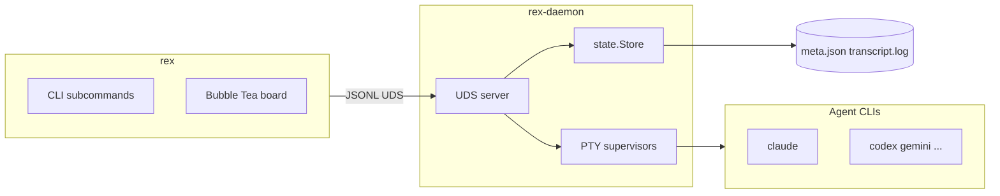

# Architecture

Rex splits terminal UI from PTY supervision. The client renders; the daemon owns child processes and disk.

## Processes

| Component | Path | Role |
|-----------|------|------|
| CLI | `internal/surface/cli/` | Subcommands, selectors, exit codes |
| TUI | `internal/surface/tui/` | Board, wizard, attach overlay |
| Client | `internal/wire/client/` | Socket dial, intents, events |
| Server | `internal/daemon/server/` | Intent handlers, fan-out |
| Store | `internal/daemon/state/` | In-memory sessions, persistence |
| PTY | `internal/daemon/pty/` | One child per session |
| Adapter | `internal/daemon/adapter/` | PTY output → state |
| Registry | `internal/catalog/registry/` | Tool definitions |
| Settings | `internal/catalog/settings/` | `config.yaml` registry |

## Spawn flow

1. User runs `rex new` or the TUI wizard → `NewSession` intent.
2. Server checks concurrency cap (`TryAcquireSession`).
3. Server creates `state.Session`, resolves `registry.Tool` command line.
4. `pty.Supervisor` starts the child with model args and optional effort.
5. Adapter reads output → updates `Session.State` → store broadcasts `SessionUpdated`.
6. Optional summarizer enqueues session id → patches `description` via Ollama.

## Attach flow

1. `rex attach <sel>` or TUI `enter` → `Subscribe` with `replay`.
2. Daemon sends transcript tail (up to 256 KiB) then live `SessionOutput`.
3. Client stdin → `SendInput` / `Reply` on the supervisor input channel.
4. Detach (Ctrl+]) stops forwarding; child keeps running.

## Design decisions

| Decision | Rationale |
|----------|-----------|
| Two binaries, UDS | TUI can exit without killing agents; multiple clients; scriptable CLI |
| State from adapters | Works for any CLI agent; no vendor HTTP APIs |
| Raw transcript log | Faithful replay and debugging |
| Crash on daemon restart | OS children are gone; persisted live states → `crashed` |
| Single settings registry | One edit point for TUI, CLI, YAML |
| Optional summarizer | Descriptions must not block core kanban |
| Silent audio fallback | Headless and SSH environments still run the board |

Detail: [agents/DECISIONS.md](agents/DECISIONS.md).

## Invariants

1. One JSON object per line on the socket; `v` must equal `1`.
2. `Hello` gates event delivery to that connection.
3. `[]byte` on the wire is base64-encoded.
4. Transcripts append raw PTY bytes; classification uses sanitized views.
5. Daemon restart remaps `queued` / `working` / `needs_input` to `crashed`.
6. Concurrency cap acquired at spawn; released on session end.
7. SIGHUP reloads the tool registry only; running PTYs unchanged.
8. `Delete` stops and removes; `Complete` signals done without removal.

## Extension points

| Extend | Mechanism |
|--------|-----------|
| New agent CLI | `tools.yaml` + adapter `detect` block |
| User settings | `internal/catalog/settings/registry.go` |
| Daemon hooks | `~/.config/rex/init.lua` (in-process; trusted) |
| Wire protocol | Bump `ProtocolVersion` and coordinate client + server |

Do not extend the wire protocol without a version bump. `OpenSession` and `Shutdown` intents exist in constants but are not implemented.

## See also

- [STRUCTURE.md](STRUCTURE.md) — repository layout
- [protocol.md](protocol.md) — JSONL reference
- [paths.md](paths.md) — files and environment
- [agents/ARCHITECTURE.md](agents/ARCHITECTURE.md) — dependency graph for agents
